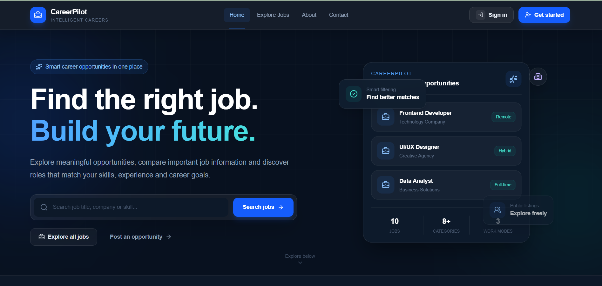
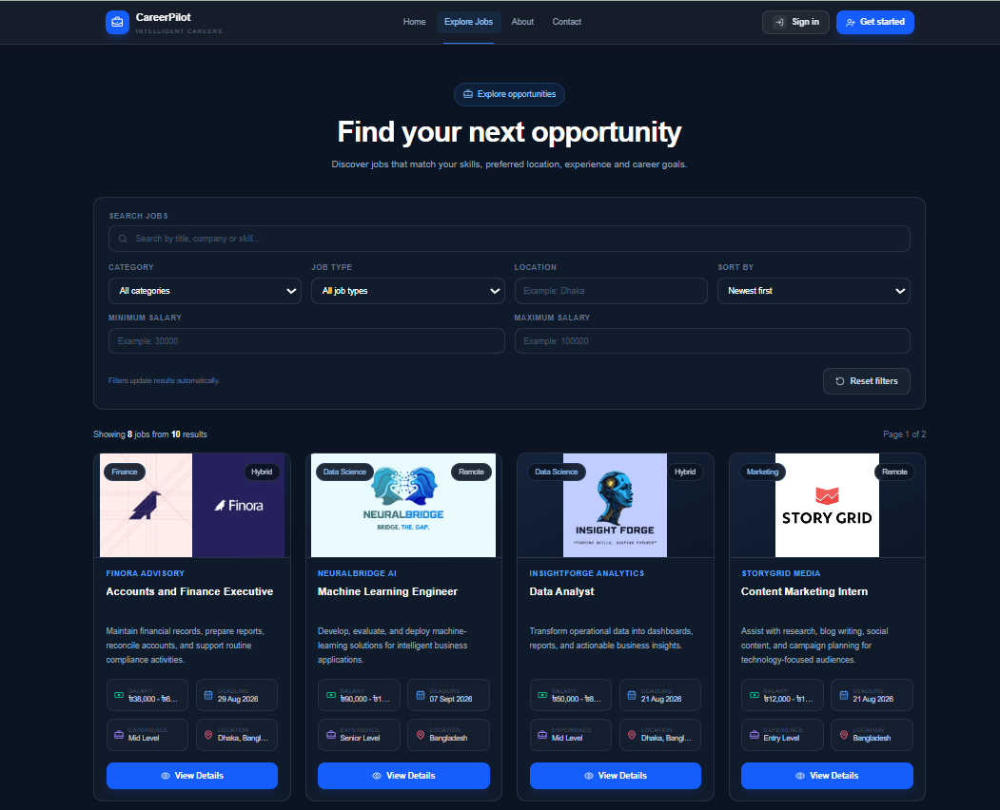
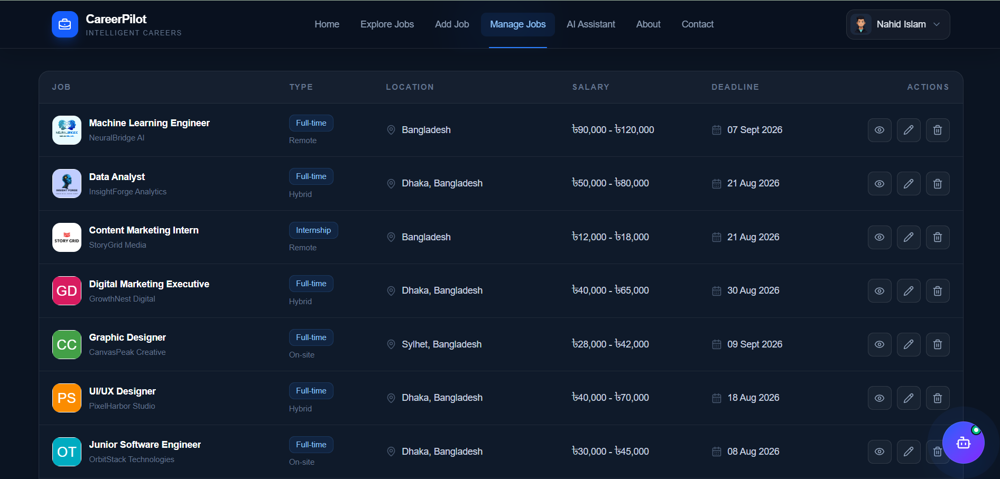
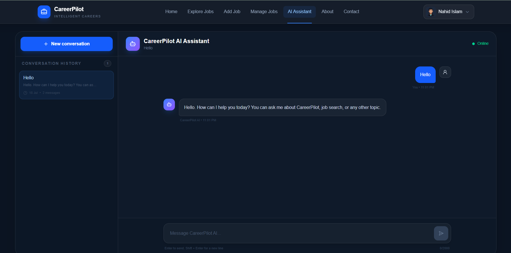

# CareerPilot AI

### An AI-Powered Job Portal and Career Assistance Platform

<p align="center">
  Discover opportunities, manage job listings, and navigate your career with AI-powered guidance.
</p>

<p align="center">
  <a href="https://careerpilot-vert-six.vercel.app">
    
  </a>
</p>

<p align="center">
  
  
  
  
  
  
  
</p>

## Overview

**CareerPilot AI** is a modern full-stack job portal designed to connect job seekers with career opportunities while providing employers with a secure and efficient platform for publishing and managing job listings.

The application combines job discovery, advanced filtering, protected employer tools, user authentication, dashboard functionality, profile management, contact support, and an AI-powered career assistant in one responsive platform.

CareerPilot AI was developed as a portfolio project to demonstrate modern full-stack development, secure authentication, REST API design, database integration, AI-powered functionality, and cloud deployment.

## Live Links

| Service              | URL                                                                                                  |
| -------------------- | ---------------------------------------------------------------------------------------------------- |
| Frontend Application | [https://careerpilot-vert-six.vercel.app](https://careerpilot-vert-six.vercel.app)                   |
| Backend API          | [https://careerpilot-server-seven.vercel.app](https://careerpilot-server-seven.vercel.app)           |
| Public Jobs API      | [https://careerpilot-server-seven.vercel.app/jobs](https://careerpilot-server-seven.vercel.app/jobs) |

## Demo Account

The following demo account can be used to explore protected features without creating a new account:

```text
Email: demo@careerpilot.com
Password: Demo@123456
```

The **Demo Login** button automatically fills in the credentials and signs the user in.

## Application Screenshots

### Home Page

The home page presents the platform introduction, published job statistics, primary actions, and featured job opportunities.

<p align="center">
  
</p>

### Jobs Explorer

The Jobs Explorer allows users to search, filter, sort, and browse published job opportunities.

<p align="center">
  
</p>

### Job Management

Authenticated users can publish new jobs, view their listings, update job information, and remove jobs they own.

<p align="center">
  
</p>

### AI Career Assistant

The AI Assistant provides career guidance through real-time streamed responses, saved conversation history, suggested prompts, and context-aware follow-up answers.

<p align="center">
  
</p>

## Key Features

### Job Discovery

- Browse publicly available job opportunities
- Search by job title, company, description, or required skills
- Filter by category, job type, location, and salary range
- Sort jobs by newest, oldest, salary, or application deadline
- Navigate through paginated job results
- View complete job details
- Explore related job opportunities
- Review salary, location, work mode, experience level, skills, and deadlines

### Job Management

- Publish new job opportunities
- View jobs created by the authenticated user
- Edit existing job listings
- Delete owned job listings
- Protect job-management pages from unauthenticated access
- Validate job ownership before update and deletion
- Track published jobs through the dashboard

### Authentication

- Secure email-and-password authentication
- Google authentication
- Better Auth integration
- Demo account login
- JWT access-token generation
- Better Auth JWKS-based token verification
- Protected frontend routes through Next.js `proxy.ts`
- Protected backend API endpoints
- Login, registration, and logout functionality

### AI Career Assistant

- Groq-powered conversational assistant
- Real-time streaming AI responses
- Saved conversation history
- Continue previous conversations
- Delete saved conversations
- Context-aware follow-up responses
- Suggested prompts after each response
- Markdown response rendering
- GitHub Flavored Markdown support
- Language-aware communication
- Roman Bangla response support
- Career, interview, job-search, and professional-development guidance

### User Experience

- Responsive design for desktop, tablet, and mobile devices
- Modern dark-themed user interface
- Active navigation states
- Desktop and mobile navigation
- Profile dropdown
- Loading skeletons
- Toast notifications
- Form validation
- Empty states
- Error handling
- Custom 404 page

### Contact Support

- Public contact form
- Name, email, subject, and message validation
- Contact-message storage in MongoDB
- Success and error feedback

## Technology Stack

### Frontend

- Next.js App Router
- React
- TypeScript
- Tailwind CSS
- Better Auth
- Sonner
- Lucide React
- React Markdown
- Remark GFM

### Backend

- Node.js
- Express.js
- TypeScript
- MongoDB Atlas
- MongoDB Node.js Driver
- Better Auth JWKS
- `jose-cjs`
- Groq SDK
- CORS
- Dotenv

### Database

- MongoDB Atlas
- Native MongoDB collections
- MongoDB ObjectId validation
- Reusable MongoDB connection handling

### Deployment

- Vercel for the frontend
- Vercel Serverless Functions for the Express backend
- MongoDB Atlas for cloud database storage
- Groq API for AI-generated responses

## Application Architecture

```text
CareerPilot AI
│
├── Frontend
│   ├── Next.js App Router
│   ├── React and TypeScript
│   ├── Tailwind CSS
│   ├── Better Auth
│   ├── Protected routes
│   ├── Job discovery interface
│   ├── Job management interface
│   ├── Dashboard and profile
│   └── AI Assistant interface
│
├── Backend
│   ├── Express REST API
│   ├── JWT token verification
│   ├── Job CRUD operations
│   ├── Contact message API
│   ├── AI conversation API
│   ├── MongoDB connection handling
│   └── Groq streaming integration
│
└── Database
    ├── Authentication collections
    ├── jobs
    ├── messages
    └── aiConversations
```

## Main Routes

| Route              | Access    | Description                                          |
| ------------------ | --------- | ---------------------------------------------------- |
| `/`                | Public    | Home page with platform statistics and featured jobs |
| `/jobs`            | Public    | Explore, search, filter, sort, and paginate jobs     |
| `/jobs/[id]`       | Public    | View complete job details and related jobs           |
| `/login`           | Public    | Normal and demo login                                |
| `/register`        | Public    | Create a new account                                 |
| `/forgot-password` | Public    | Password recovery page                               |
| `/about`           | Public    | Information about CareerPilot AI                     |
| `/contact`         | Public    | Contact and feedback form                            |
| `/jobs/add`        | Protected | Publish a new job                                    |
| `/jobs/manage`     | Protected | Manage jobs created by the authenticated user        |
| `/dashboard`       | Protected | View job statistics and recent activity              |
| `/profile`         | Protected | View and manage profile information                  |
| `/ai-assistant`    | Protected | Access the AI career assistant                       |

## API Endpoints

### Public Endpoints

| Method | Endpoint    | Description                                                 |
| ------ | ----------- | ----------------------------------------------------------- |
| `GET`  | `/`         | Check whether the backend server is running                 |
| `GET`  | `/jobs`     | Retrieve jobs with search, filters, sorting, and pagination |
| `GET`  | `/jobs/:id` | Retrieve one job and related jobs                           |
| `POST` | `/messages` | Submit and store a contact message                          |

### Protected Job Endpoints

| Method   | Endpoint               | Description                                   |
| -------- | ---------------------- | --------------------------------------------- |
| `POST`   | `/manage/jobs`         | Publish a new job                             |
| `GET`    | `/manage/jobs/my-jobs` | Retrieve jobs owned by the authenticated user |
| `PATCH`  | `/manage/jobs/:id`     | Update a job owned by the authenticated user  |
| `DELETE` | `/manage/jobs/:id`     | Delete a job owned by the authenticated user  |

### Protected AI Endpoints

| Method   | Endpoint                | Description                                     |
| -------- | ----------------------- | ----------------------------------------------- |
| `GET`    | `/ai/conversations`     | Retrieve AI conversation history                |
| `GET`    | `/ai/conversations/:id` | Retrieve one AI conversation                    |
| `DELETE` | `/ai/conversations/:id` | Delete one AI conversation                      |
| `POST`   | `/ai/chat`              | Stream an AI response and save the conversation |

Protected backend requests require an access token:

```http
Authorization: Bearer <access_token>
```

## Database Collections

| Collection                 | Purpose                                                                      |
| -------------------------- | ---------------------------------------------------------------------------- |
| `jobs`                     | Stores published job listings                                                |
| `messages`                 | Stores contact-form submissions                                              |
| `aiConversations`          | Stores AI conversation history and messages                                  |
| Authentication collections | Store Better Auth users, sessions, accounts, and related authentication data |

## Project Structure

A simplified project structure is shown below:

```text
careerpilot-client/
├── public/
│   └── screenshots/
│       ├── home-page.png
│       ├── jobs-explorer.png
│       ├── job-management.png
│       └── ai-assistant.png
│
├── src/
│   ├── app/
│   ├── components/
│   ├── lib/
│   └── proxy.ts
│
├── .env
├── package.json
└── README.md
```

Backend structure:

```text
careerpilot-server/
├── index.ts
├── .env
├── package.json
├── tsconfig.json
└── vercel.json
```

## Local Development

### Prerequisites

Install or configure the following before starting:

- Node.js 20 or later
- npm
- Git
- MongoDB Atlas account
- Groq API key
- Better Auth configuration

## Frontend Setup

Clone the frontend repository:

```bash
git clone https://github.com/nahidforever/CareerPilot-Client
```

Install dependencies:

```bash
npm install
```

Create a `.env.` file in the project root:

```env
NEXT_PUBLIC_SERVER_URI=http://localhost:5000

NEXT_PUBLIC_DEMO_EMAIL=demo@careerpilot.com
NEXT_PUBLIC_DEMO_PASSWORD=Demo@123456

BETTER_AUTH_SECRET=your_better_auth_secret
BETTER_AUTH_URL=http://localhost:3000
```

Add any additional database or authentication environment variables required by the Better Auth configuration used in the project.

Start the frontend development server:

```bash
npm run dev
```

The frontend will be available at:

```text
http://localhost:3000
```

## Backend Setup

Clone the backend repository:

```bash
git clone https://github.com/nahidforever/CareerPilot-Server
```

Install dependencies:

```bash
npm install
```

Create a `.env` file in the project root:

```env
PORT=5000

MONGODB_URI=your_mongodb_atlas_connection_string
CLIENT_URL=http://localhost:3000

GROQ_API_KEY=your_groq_api_key
GROQ_MODEL=llama-3.3-70b-versatile
```

Start the backend development server:

```bash
npm run dev
```

The backend will be available at:

```text
http://localhost:5000
```

Test the backend:

```text
http://localhost:5000/
http://localhost:5000/jobs
```

## Available Scripts

The exact scripts may differ between the frontend and backend repositories.

```bash
npm run dev
npm run build
npm run lint
npm run type-check
```

| Command              | Description                                    |
| -------------------- | ---------------------------------------------- |
| `npm run dev`        | Starts the development server                  |
| `npm run build`      | Creates a production build                     |
| `npm run lint`       | Checks the project for linting issues          |
| `npm run type-check` | Validates TypeScript without generating output |

Only retain commands that are defined inside the corresponding `package.json` file.

## Production Environment Variables

### Frontend

```env
NEXT_PUBLIC_SERVER_URI=https://careerpilot-server-seven.vercel.app

NEXT_PUBLIC_DEMO_EMAIL=demo@careerpilot.com
NEXT_PUBLIC_DEMO_PASSWORD=Demo@123456

BETTER_AUTH_SECRET=your_production_better_auth_secret
BETTER_AUTH_URL=https://careerpilot-vert-six.vercel.app
```

Add the production database or authentication variables required by the Better Auth configuration.

### Backend

```env
MONGODB_URI=your_mongodb_atlas_connection_string
CLIENT_URL=https://careerpilot-vert-six.vercel.app

GROQ_API_KEY=your_groq_api_key
GROQ_MODEL=llama-3.3-70b-versatile
```

> Never commit `.env` files containing private credentials, secrets, API keys, or database connection strings.

## Authentication Flow

```text
User
  │
  ├── Registers or signs in through Better Auth
  │
  ├── Receives an authenticated session
  │
  ├── Requests a JWT access token
  │
  ├── Sends the token to protected backend endpoints
  │
  └── Backend verifies the token through Better Auth JWKS
```

Protected frontend routes are checked through `proxy.ts`, while sensitive backend operations verify the JWT access token before processing the request.

---

## Security

- Protected frontend pages are checked through Next.js `proxy.ts`
- Protected backend endpoints verify Better Auth JWT access tokens
- Job update and delete operations validate resource ownership
- MongoDB ObjectIds are validated before database operations
- User input is normalized and validated
- Search input is escaped before being used in regular expressions
- Sensitive environment variables remain server-side
- MongoDB credentials are stored in environment variables
- Public demo credentials are restricted to the dedicated demo account
- CORS is configured to allow the approved frontend origin
- AI conversations are restricted to the authenticated owner

## Deployment

### Frontend Deployment

1. Push the frontend repository to GitHub.
2. Import the repository into Vercel.
3. Add all required frontend environment variables.
4. Set the production Better Auth URL.
5. Deploy the application.
6. Test login, registration, protected routes, and API integration.

### Backend Deployment

1. Push the backend repository to GitHub.
2. Import the repository into Vercel.
3. Add all required backend environment variables.
4. Set `CLIENT_URL` to the deployed frontend URL.
5. Confirm that MongoDB Atlas allows the deployment connection.
6. Deploy the Express backend.
7. Redeploy after changing environment variables.
8. Test the root endpoint and public Jobs API.

## Testing Checklist

After deployment, verify the following:

- Home page loads successfully
- Featured jobs are displayed
- Jobs Explorer retrieves published jobs
- Search and filters work correctly
- Pagination works correctly
- Job details page opens correctly
- Registration creates a user account
- Login and Demo Login work correctly
- Protected routes detect the authenticated session
- Add Job publishes a job
- Manage Jobs displays owned jobs
- Edit Job updates a listing
- Delete Job removes a listing
- Dashboard displays job information
- Profile page displays user information
- Contact form stores messages
- AI Assistant streams responses
- AI conversation history is saved
- Previous conversations can be reopened
- AI conversations can be deleted
- Logout clears the authenticated session
- Mobile navigation works correctly
- Custom 404 page appears for invalid routes

## Future Improvements

- Password-reset email integration
- Job application submission and tracking
- Resume upload
- AI-powered resume analysis
- Saved jobs and favourites
- Employer and candidate role separation
- Email notifications
- Advanced job analytics
- Admin dashboard
- AI-powered job recommendations
- Automated unit and integration testing
- Accessibility audits
- Performance monitoring

## Project Purpose

CareerPilot AI was developed as a full-stack portfolio project to demonstrate:

- Modern frontend development with Next.js
- Responsive user-interface design
- Secure authentication and protected routes
- REST API development with Express
- MongoDB data modelling and CRUD operations
- Search, filtering, sorting, and pagination
- Resource ownership validation
- AI integration with streamed responses
- Conversation-history management
- Full-stack deployment on Vercel
- Environment-variable and cloud-service configuration

## Author

**MD. Nahid Islam**

- GitHub: [https://github.com/nahidforever](https://github.com/nahidforever)
- LinkedIn: [https://www.linkedin.com/in/nahidforever/](https://www.linkedin.com/in/nahidforever/)
- Email: n.i.nahid02@gmail.com

<p align="center">
  Built with dedication using Next.js, Express.js, MongoDB, Better Auth, and Groq AI.
</p>
